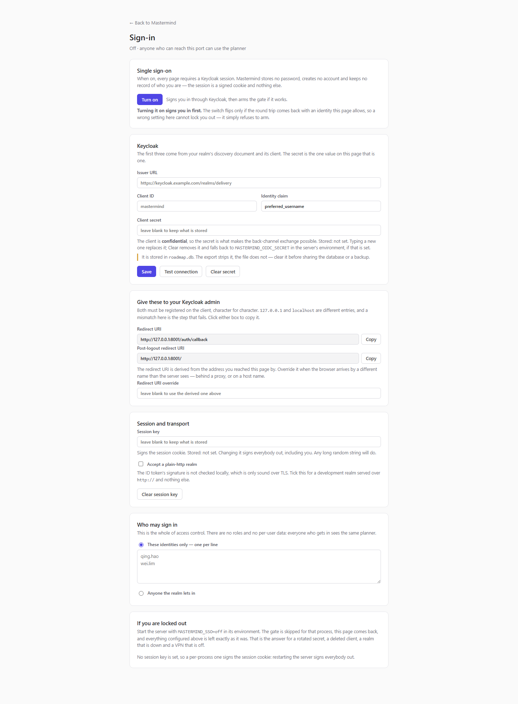

# Running it for a team

Mastermind on your own machine needs nothing but the Quick start in the
[README](../README.md). This page is for serving it to other people: the
container, the sign-in gate, and what to do when something goes wrong.

## Serve it with Docker Compose

```powershell
Copy-Item .env.example .env      # then fill in the two secrets, or leave them
docker compose up -d --build
docker compose logs -f           # one worker, so this is the whole story
docker compose down
```

It comes up on <http://127.0.0.1:8000>, and **only** there until you decide
otherwise.

Three things must outlive the container, and `compose.yaml` mounts each for its
own reason:

| Mount | Why |
|---|---|
| `./data` | The dataset and the startup backups beside it. Irreplaceable. |
| `./sprints` | The real record of work done — one markdown file per fortnight, and there is no sprint table anywhere. |
| `./templates` | Holds `sprint.md`, editable from the Sprint tab *and* tracked by git. Without the mount, an *Edit template* save vanishes on the next rebuild. Mounted as the directory, not the file: a single-file bind mount is its own mount point, and a template save renames a scratch file over its target, which fails with `EBUSY` onto a mount point. |

> **Run it with one worker.** The live-connection registry — who is here, and who
> gets told a write landed — is process memory. A second worker would announce a
> change to half the open pages and leave the rest silently stale. The image's
> command is single-worker already; the point is not to add `--workers` to it.

## Two steps, and the order is the point

### 1. Arm sign-in first

Open <http://127.0.0.1:8000/auth/settings>.



Fill in the Keycloak realm's issuer URL, the client id and the client secret,
then say who may in — an allowlist of identities, or anyone the realm lets in.
Give your Keycloak admin the two redirect URIs the page shows; it compares them
character for character, and `127.0.0.1` and `localhost` are different entries.

Press **Turn on**. It signs you in through Keycloak first and arms the gate only
if that round trip comes back with an identity the page allows — so a wrong
setting refuses to arm rather than locking you out.

### 2. Then open the port

Change `compose.yaml`'s published port from `127.0.0.1:8000:8000` to
`8000:8000`, and `docker compose up -d` again.

Doing this the other way round exposes an unauthenticated instance: anyone who
can reach the port can read the whole roadmap **and** `POST /api/import` over it,
which replaces the entire dataset by design.

## What sign-in is, and is not

The gate asks Keycloak "is this you" over OIDC and stores nothing about the
answer. There is no `user` table, no roles, no permissions, no `created_by`, no
assignee, no audit log and no per-user preferences. Everyone who gets in sees the
same planner. The session is a signed cookie; there is no session store.

Presence — the badge showing who is typing in a field — shows a name it was
handed for as long as the socket is open. It records nothing.

## Where configuration lives

Sign-in is configured on its own page and stored in the database, secrets
included. The environment variables of the same name are **fallbacks**, read only
where the page's field is empty.

Two are environment-only on purpose:

| Variable | Why it is not a field |
|---|---|
| `MASTERMIND_SSO=off` | The recovery hatch. A hatch stored inside the thing it rescues is no hatch. |
| `MASTERMIND_PUBLIC=1` | Decides whether the Sign-in page is itself gated. As a database field it could lock away the page that edits it. The container sets it, because it binds a non-loopback interface. |

The AI provider key for `scripts/sprint_review.py` is environment-only too — it
belongs to a CLI script with no page.

## Locked out

Start the server with `MASTERMIND_SSO=off` in its environment. The gate is
skipped for that run, the Sign-in page comes back, and nothing you configured is
lost. Repair it, then unset the variable.

That is the answer for a rotated secret, a deleted client, a realm that is down,
and a VPN that is not connected — none of which anything inside the app can fix.

## Backup and the data file

- **Every start** copies the database to `data/backups/roadmap-<timestamp>.db`
  before it migrates anything, keeping the last ten. That makes the migration
  hazard recoverable; it does not make it safe, because the copy is only ever as
  old as the last start.
- **Export** at the foot of the sidebar writes the whole dataset to JSON.
  **Import** replaces it entirely. Export → wipe → import restores an identical
  dataset; it is the guard against the tool being a dead end.
- An export carries **no sign-in configuration**: every such column is named
  `sso_` and the whole prefix is stripped on the way out. That strip is the one
  line keeping a secret out of the file, and it is a prefix test — a sign-in
  column added without the prefix would walk straight into the JSON.

> **`data/roadmap.db` is a secret-bearing file**, along with every copy under
> `data/backups/` and any `.bak` beside it. Clear the client secret on the
> Sign-in page before handing one to anybody. An export is safe to send; the
> database is not.

Keep `data/` on a local disk or a container volume. SQLite runs in WAL mode here,
which leaves `-wal` and `-shm` files beside the database and does not work over a
network share or a mapped drive.

## Editing the code while it runs

`uvicorn --reload` restarts on every source save, and every start runs
`init_db()` — and therefore the schema migration — against `data/roadmap.db`. A
half-finished edit runs the moment it hits disk; it does not need to be run
deliberately, or even to be finished.

Before touching schema or anything destructive: stop the server, or point it at a
copy. Check for one you forgot about, too:

```powershell
Get-CimInstance Win32_Process -Filter "Name like '%python%'" |
  Where-Object { $_.CommandLine -like '*uvicorn*' }
```

## Optional: the sprint review script

```powershell
.\.venv\Scripts\python.exe -m pip install -r requirements-ai.txt
.\.venv\Scripts\python.exe scripts\sprint_review.py --history 3
```

It reads sprint files and asks a model to review them. The dependency is lazily
imported and is deliberately **not** installed in the container: the app
installs, serves and passes its tests without it. The model key is read from the
environment and never from the database.
