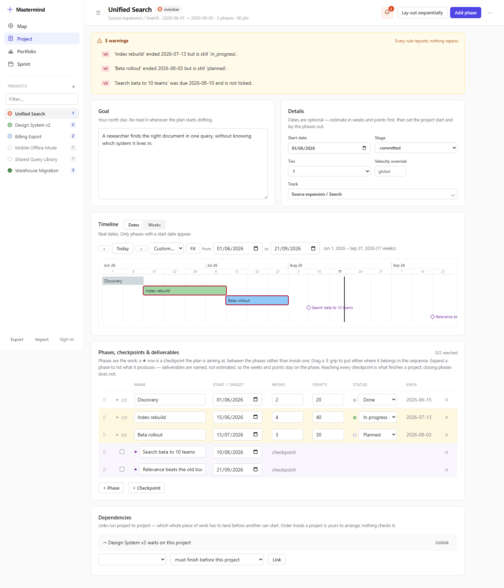
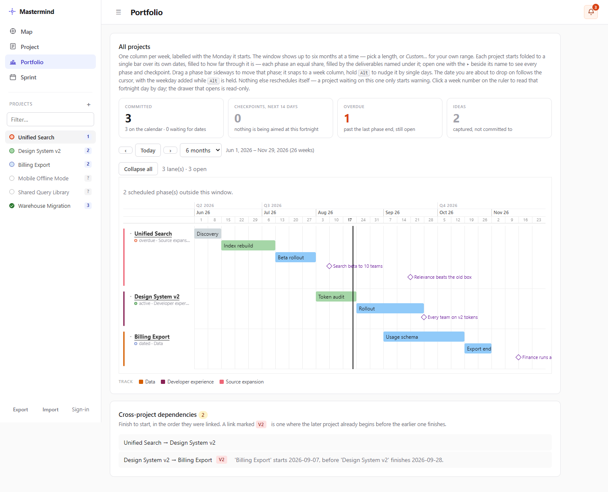
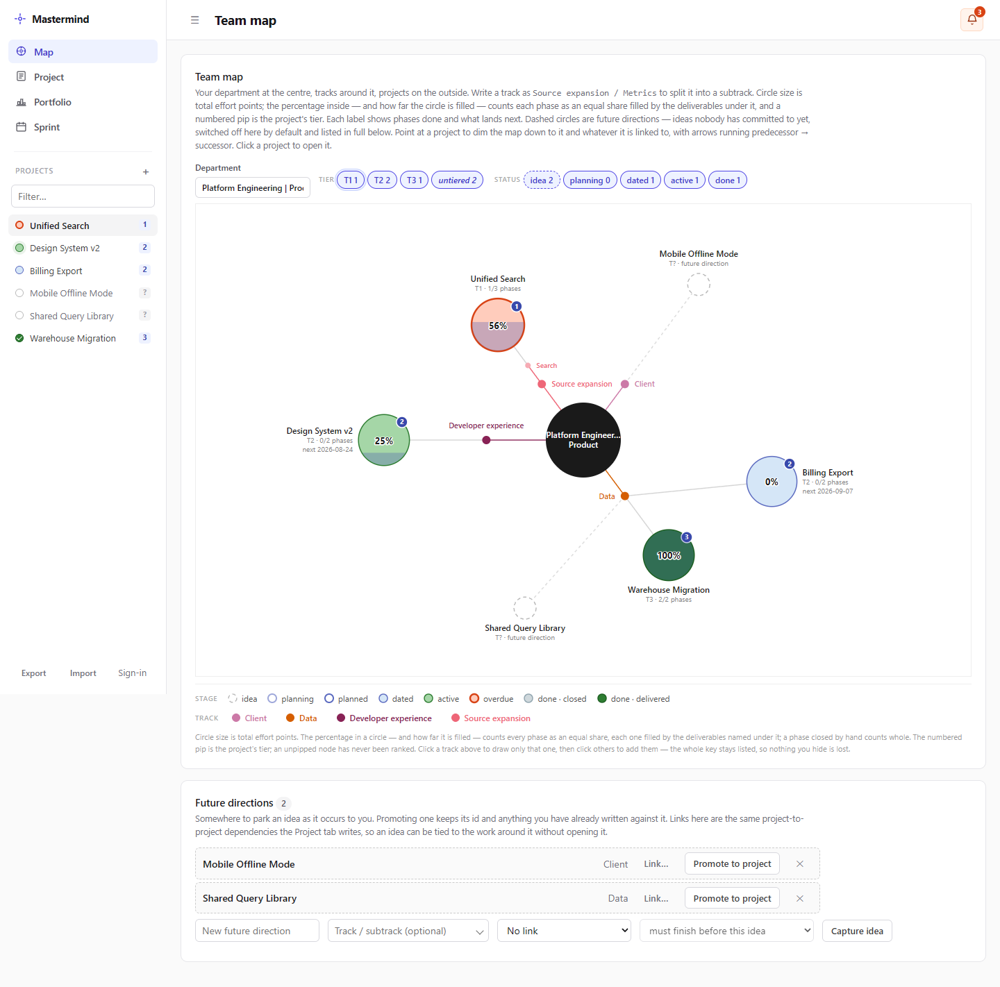
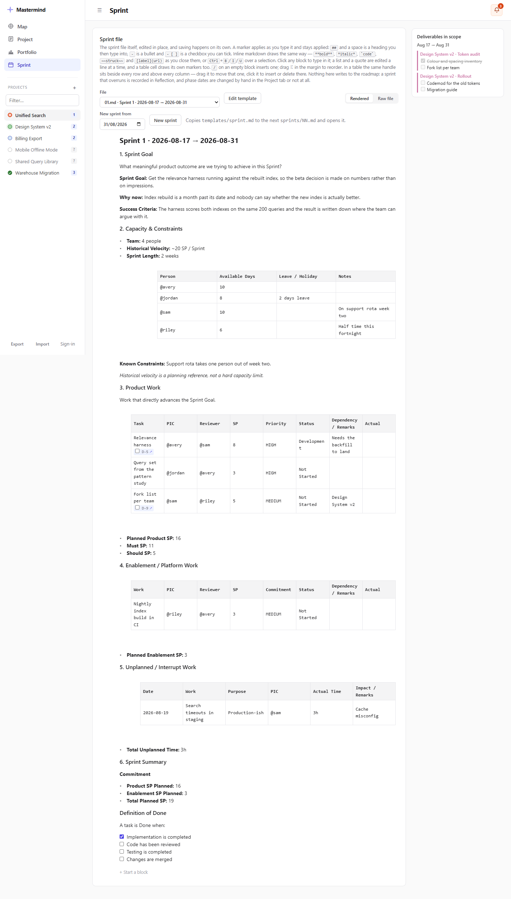

# The four views

Mastermind has four tabs, and they follow the order work travels in: an idea is
captured on the **Map**, costed on **Project**, dated on **Portfolio**, and run
in a **Sprint**. The sidebar lists every project with a stage dot and its tier
digit, and the bell in the top bar is the same on all four.

The screenshots below are a seeded demo dataset, not a real roadmap.

## Project

What one project is, in detail. This is the landing tab.

Top to bottom:

- **Warnings banner** — every rule firing on this project, each tagged with its
  number. It goes quiet rather than away when there is nothing to report. The
  note on the right is the whole philosophy: *every rule reports; nothing
  repairs*.
- **Goal** — free text, yours, never parsed.
- **Details** — start date, stage (idea / committed / closed), tier, velocity
  override and track. Only three things here are yours to set; everything else
  about a project's status is derived (see [concepts.md](concepts.md)).
- **Unscheduled** — phases you have estimated but not placed. Only appears when
  there are some.
- **Timeline** — this project alone, in **Dates** mode (a calendar; only dated
  phases appear) or **Weeks** mode (week 1 onwards, every phase appears). The
  window controls page it, and **Fit** returns to the project's own span.
  Checkpoints draw as diamonds; the vertical line is today.
- **Phases, checkpoints & deliverables** — one ordered list, because a checkpoint
  sits *between* phases and two separate tables could not say that. Drag a ⠿ grip
  to reorder either kind. Expand a phase with ▸ to list its deliverables and tick
  them off. A phase row shows its derived end date and its deliverable tally.
- **Dependencies** — the projects this one waits on, and the ones waiting on it.

The top bar carries **Lay out sequentially** (date every undated phase, back to
back from the project start), **Add phase**, and a **⋯** menu holding the project
name, the global settings (velocity, sprint length, V1 tolerance) and Delete.

## Portfolio

Every project on one shared time axis.

- **Headline counts** — how much is committed, what checkpoints fall in the next
  fortnight, what is overdue, and how many ideas have been captured but not
  committed to.
- **Window bar** — one column per week, labelled with the Monday it starts, up to
  six months at a time. Pick a preset length or *Custom…* for your own range.
- **Swimlanes** — one per committed project. A folded lane is a single bar over
  the project's own dates, filled to how far through it is; **Expand all** (or
  the ▸ beside a name) opens it into one row per phase and per dated checkpoint.
  Bar colour is the project's track, listed in the key below the chart.
- **Not placed yet** — a tray of projects you have estimated but not dated. Drag
  one onto a week to start it there: its undated phases are laid out back to back
  from that Monday, and phases that already have dates keep them. The drop can be
  undone until you reload.
- **Cross-project dependencies** — every link, in the order they were made, with
  the ones firing V2 marked and explained.

**Dragging.** Drag a phase bar sideways to move that phase. It snaps to a week
column; hold <kbd>Alt</kbd> to nudge by single days. The date you are about to
drop on follows the cursor. Nothing else moves — a project waiting on this one
starts warning instead.

**The fortnight drawer.** Click a week number on the ruler to read that fortnight
day by day. The drawer is read-only with one exception: **Plan this fortnight →**
copies `templates/sprint.md` to the next `sprints/NN.md` and opens it on the
Sprint tab. Press it again for the same fortnight and it opens the file that
already exists rather than making a second one.

## Map

Where the team is pointed, rather than when things land.

- The **department** sits at the centre (set the name in the field above the
  canvas), **tracks** radiate from it, and **projects** are the circles on the
  outside. Writing a track as `Source expansion / Search` splits it into a track
  and a subtrack.
- **Circle size** is total effort points. The **percentage inside** — and how far
  the circle is filled — counts each phase as an equal share, filled by the
  deliverables named under it. A phase closed by hand counts whole.
- The **numbered pip** is the project's tier; an unpipped node has never been
  ranked. **Dashed circles** are ideas.
- **Point at a project** to dim the map down to it and whatever it links to, with
  arrows running predecessor → successor. **Click one** to open it.

**Filters.** Tier chips and status chips are independent. Both idea and done
start switched off, so the map opens on committed work; the legend under the
canvas still spells out all seven stages, so nothing you hide is lost.

**Future directions** below the canvas is where ideas are captured and listed in
full. Promoting one keeps its id and everything already written against it, and
links made here are the same project-to-project dependencies the Project tab
writes.

## Sprint

One markdown file per fortnight, edited in place.

- **File** picks a sprint from `sprints/`, newest first, plus the template every
  one of them is a copy of. **Edit template** opens `templates/sprint.md` in the
  same editor — it changes what the next new sprint copies and no file already on
  disk.
- **New sprint from** takes any day in a fortnight, snaps it back to that
  fortnight's Monday, and copies the template into the next numbered file. A
  fortnight overlapping a sprint already on disk is refused: one team runs one
  sprint at a time.
- **Rendered / Raw file** switches between the document and the whole file as
  text. The file is the record; the document is a view of it. Saving happens on
  its own.
- **Deliverables in scope** on the right is the roadmap read-only, drawn from the
  fortnight in this file's own heading. It writes nothing and offers no insert —
  putting a deliverable into a sprint is the Phase 2 line.

**Editing.** Markers apply as you type them: `##` and a space for a heading, `-`
for a bullet, `- [ ]` for a checkbox you can tick. Inline `**bold**`, `*italic*`,
`` `code` ``, `~~struck~~` and `[label](url)` draw as you close them, or use
<kbd>Ctrl</kbd>+<kbd>B</kbd>/<kbd>I</kbd>/<kbd>U</kbd> over a selection. `/` on an
empty block inserts one; drag the ⠿ handle in the margin to reorder. In a table
the same handle sits beside every row and above every column — drag it to move
that one, click it to insert or delete there.

**Linking a row to a deliverable.** Write `D-42` anywhere in a row, or type `/`
in a cell and start typing the deliverable's name to pick one. A linked row draws
that deliverable's tick and an arrow to it, and ticking either place is the same
tick. One link per row; rows without a reference are ordinary tasks.

Nothing in this tab writes to the roadmap. A sprint that overruns is recorded in
the file; phase dates change by hand on the Project tab or not at all.
